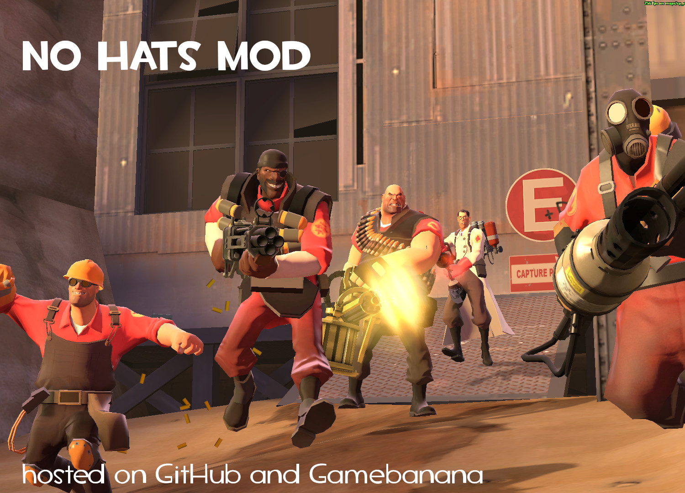
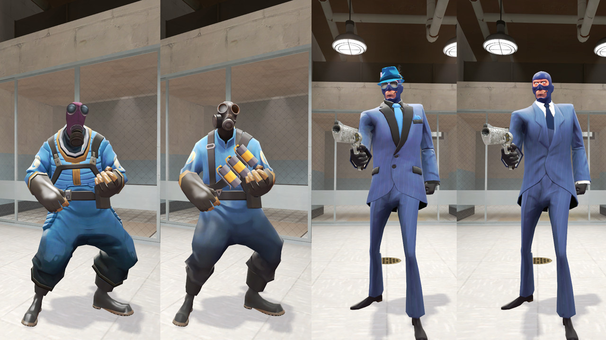
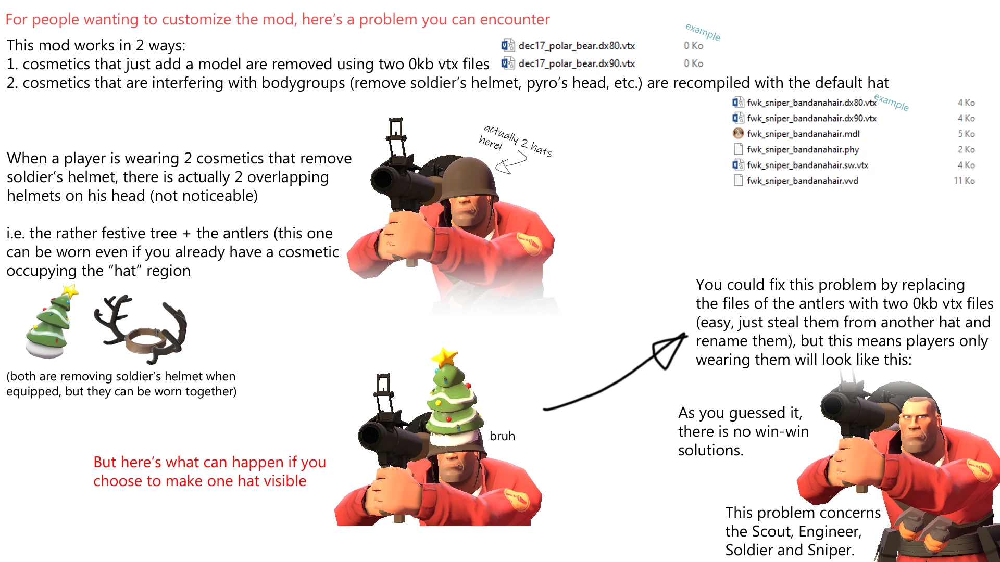

    
    </a>

# no-hats-bgum

This is a pack of mods whose purpose is to remove some visual aspects from Team Fortress 2 (cosmetics, skins, unusuals, etc).

> Note: apart from no_hats_bgum.vpk, all the mods are dormant. I will not add new mods or work on the existing ones. Occasional bug fixes may be released, but this is without any guarantees.

## Related repositories

- [nhcustom2](https://github.com/Fedora31/nhcustom2), a command-line program whose purpose is to modify the no-hats-mod.
- [nhupdater2](https://github.com/Fedora31/nhupdater2), shell scripts to help generating the files used by no-hats-bgum.vpk.
- [nhschema](https://github.com/Fedora31/nhschema), a program that reads TF2's item schema and outputs data for nhupdater2.

> There exist multiple versions of the so-called `no-hats-mod`. The version provided here makes the default headgears reappear. If you want a version which only removes the hats, you can find an up-to-date version [here](https://www.teamfortress.tv/56398/no-hats-mod-headsfeet-2020-edition).

## Navigation

* [Download](https://github.com/Fedora31/no-hats-bgum/releases)
* [Installation](#installation)
* [Modify](#modify)
* [Update script (outdated)](./scripts)
* [Buglist](./.github/BUGLIST.md)
* [Source](./nhm_source)
* [Questions & Answers](./.github/Q%26A.md)
* [Credits](./.github/CREDITS.md)

## Primary mod - no\_hats\_bgum.vpk

This is the main mod of the pack, it prevents the game from loading cosmetics. It also makes the default headgear reappear, should it be removed by the cosmetic the player is wearing. (E.g. no more soldiers jumping around without helmet, safety first amarite?). It also works on Valve servers.

  

### Concerning performance...

You can get a **small** boost in performance with this mod, but it shouldn't be the main reason to install it. On my end, I generally have a ~7fps increase.

**Also:** I've seen a [video](https://youtu.be/Cw4DnQ4K9jk?t=469) where this mod actually hinders performance. Please make your own tests, depending on your setup you may want to look for something else.

In a nutshell:
- If you are concerned about the game's artstyle, this mod is a good option.
- If you are only concerned about performance and don't care about missing bodyparts, then something like [JarateKing's CleanTF2plus](https://github.com/JarateKing/CleanTF2plus) should be more fitting.

## Secondary mods

- no\_bugged\_misc.vpk
  - Rarely, some pyro masks still appear in the main mod. This is due to a bug, the mod is unable to replace them with the default pyro head so they're simply not showing up. For visibility reasons (snipers) I let them appear by default but you can use this mod if you want to remove them completely (they will sometimes still appear due to the same bug). This mod is intended to be installed with the main mod.
- no\_hats\_creatorstf.vpk
  - This mod is for people playing in the creators.tf servers. It removes the custom cosmetics the servers add. This mod is intended to be installed with the main mod.
  - You may be wondering why this mod exists since the creators.tf servers provide the command `/ctfhats` to disable custom hats. This is because this command makes the hats disappear, but does not replace them with the default headgear. So for now, this mod is still included in the pack.
- no\_unusuals.vpk
  - This file removes unusual particles but doesn't work on Valve servers (because of their sv_pure whitelist). **If TF2 receives a new update which adds new particle effects, you should remove this mod and wait for a new version to come out.**
- no\_christmas\_lights.vpk
  - Removes christmas lights from festivized weapons. Not to confuse with the limited **festive** weapons, not affected by this mod.
- no\_skins.vpk
  - This file removes the majority of the weapon skins, with some exceptions. This mod doesn't work on Valve servers and **you need to move all of your skinned items at the end of your inventory**, otherwise your weapons will load indefinitely.
  - This mod received an update that should properly hide skins that were previously showing in the older version. However, some of the weapons wearing those skins may have some issues like a weird reflectivity (Killer Bee) or an orange shine (Dragon Slayer). Other problems may exist.
- no\_botkiller.vpk
  - Removes robot heads from weapons.
- no\_zombie\_skins.vpk
  - Replaces Voodoo-cursed Souls skins with the default player model. This mod doesn't work on Valve servers. It was contributed by gabrielwoj.

## Installation

* On Windows, place any .vpk file into:
   `C:\Program Files (x86)\Steam\steamapps\common\Team Fortress 2\tf\custom`

* On Linux, place any .vpk file into:
`~/.local/share/Steam/steamapps/common/Team Fortress 2/tf/custom`

If your game isn't in the default location, you can always go on the game's page in your Steam library. `click the settings icon > Manage > Browse local files`

## Bug report

* If you ever come across a bug (e.g. a cosmetic still visible or a player not having the default headgear reappear) you can send me an e-mail at `pevhs AT airmail DoT cc`. PLEASE read the [Buglist](./.github/BUGLIST.md) and the [Q&A](./.github/Q%26A.md) if you want to contact me. (You can also post a new issue on this repo but **know that I don't check it often, I'll always be more reachable through e-mails.**)

## Modify

**You should use [nhcustom2](https://github.com/Fedora31/nhcustom2).** This program is miles better than the old, manual way. You can still watch the two videos that were created when this program didn't exist here:

* [Windows](https://streamable.com/b9evay)
* [Linux](https://streamable.com/v0g3dh)

Please note that even with nhcustom2, there are some limitations. See the following image:

  

## Links to similar mods

* [springrolls' No Hats Mod + Headfeet, 2020+ Edition](https://www.teamfortress.tv/56398/no-hats-mod-headsfeet-2020-edition). They provide the "original" updated version of the mod which removes every cosmetics and a Headsfeet variant (keeps the cosmetics that interfere with bodygroups).

* [JarateKing's CleanTF2plus](https://github.com/JarateKing/CleanTF2plus). A set of scripts providing a version of No Hats Mod removing every cosmetics. This mod is generated automatically, so you don't have to wait on anyone to have an updated version.

* [jeebsAU's No Hats Mod](https://github.com/jeebsAU/No-Hats-Mod). The mod from which the version provided here is based on. **This version isn't maintained anymore.**

  

