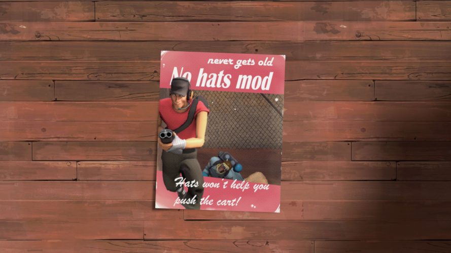

 
  

This is a pack of mods whose purpose is to remove some visual aspects from Team Fortress 2 (cosmetics, skins, unusuals and some christmas lights).

These versions don't have release numbers at the end, I'll simply replace them whenever they receive an update so the .vpk files names won't change. This should mean you could add them to your personal tf2 repo to receive any updates as soon as they're out.

**If you modified the mod**, I added a new `updates` directory containing vpk files that only remove cosmetics from specific updates, starting with the one from summer 2020. Like that you won't need to scrap your modified mod to have the latest hats disappear. You could merge them together to avoid having too many files in your `custom` folder. If you figured out how to modify the mod, you should have no problems doing this. ;)

[A script](./releases) is now available for Windows users which checks if a new version is available and installs it automatically. It was contributed by [junior](./.github/CREDITS.md)!

# Navigation

* [Installation](#installation)
  * [Update Script](./scripts)
  * [Changelog](./.github/CHANGELOG.md)
* [Buglist](./.github/BUGLIST.md)
  * [Modify](#modify)
  * [Specific Updates](./updates)
* [Questions & Answers](./.github/Q%26A.md)
* [Credits](./.github/CREDITS.md)

## Primary mod

- no\_hats\_bgum.vpk
  - This is the main mod of the pack, it prevents the game from loading cosmetics. It also makes the default headgear reappear, should it be removed by the cosmetic the player is wearing. (E.g. no more soldiers jumping around without helmet, safety first amarite?)
  
  
  
  

### Concerning performance...

In a nutshell:
- If you are concerned about the game's artstyle and performance, this mod is a good option.
- If you are only concerned about performance and don't care about missing bodyparts, then something like [JarateKing's CleanTF2plus](https://github.com/JarateKing/CleanTF2plus) should be more fitting.
  
## Secondary mods

- no\_bugged\_misc.vpk
  - Rarely, some pyro masks still appear in the main mod. This is due to a bug, the mod is unable to replace them with the default pyro head so they're simply not showing up. For visibility reasons (snipers) I let them appear by default but you can use this mod if you want to remove them completely (they will sometimes still appear due to the same bug). This mod is intended to be installed with the main mod.
- no\_hats\_creatorstf.vpk
  - This mod is for people playing in the creators.tf servers. It removes the custom cosmetics the servers add. This mod is intended to be installed with the main mod.
- no\_unusuals.vpk
  - This file removes unusual particles but doesn't work on Valve servers (because of their sv_pure whitelist). I'm not the person maintaining this mod thus I will not update it if some unusuals are still appearing.
- no\_christmas\_lights.vpk
  - Removes christmas lights from festivized weapons. Not to confuse with the limited **festive** weapons, not affected by this mod.
- no\_skins.vpk
  - This file removes the majority of the weapon skins, with some exceptions. This mod doesn't work on Valve servers and you need to move all of your skinned items at the end of your inventory, otherwise your weapons will load indefinitely.
- no\_botkiller.vpk
  - Removes robot heads from weapons.

## Installation

* On Windows, place any .vpk file into: 
   `C:\Program Files (x86)\Steam\steamapps\common\Team Fortress 2\tf\custom`

* On Linux, place any .vpk file into: 
`~/.local/share/Steam/steamapps/common/Team Fortress 2/tf/custom`

If your game isn't in the default location, you can always go on the game's page in your Steam library. `click the settings icon > Manage > Browse local files`

## Bug report

* If you ever come across a bug (e.g. a cosmetic still visible or a player not having the default headgear reappear) you can send me an e-mail at `comments3294071264 AT net-c DoT com` or contact me through [Steam](https://steamcommunity.com/id/mranchois). PLEASE read the [Buglist](./.github/BUGLIST.md) and the [Q&A](./.github/Q%26A.md) if you want to contact me. (You can also post a new issue on this repo but know that I don't check it often. Overall, I prefer e-mails.)

## Modify

#### Here are 2 videos "trying" to show how you can modify the mod to let some cosmetics appear.

* [Windows](https://streamable.com/uav0li)

* [Linux](https://streamable.com/vxchci)

## Links to similar mods

* [springrolls' No Hats Mod + Headfeet, 2020+ Edition](https://www.teamfortress.tv/56398/no-hats-mod-headsfeet-2020-edition). They provide the "original" updated version of the mod which removes every cosmetics, a Headsfeet variant (keeps the cosmetics that interfere with bodygroups) and another one named "Stock HeadsFeet" which also makes the default hats reappear!

* [JarateKing's CleanTF2plus](https://github.com/JarateKing/CleanTF2plus). A set of scripts providing a version of No Hats Mod removing every cosmetics. This mod is generated automatically, so you don't have to wait on anyone to have an updated version.

* [jeebsAU's No Hats Mod](https://github.com/jeebsAU/No-Hats-Mod). The mod from which the version provided here is based on. **This version isn't maintained anymore.**

 
  

